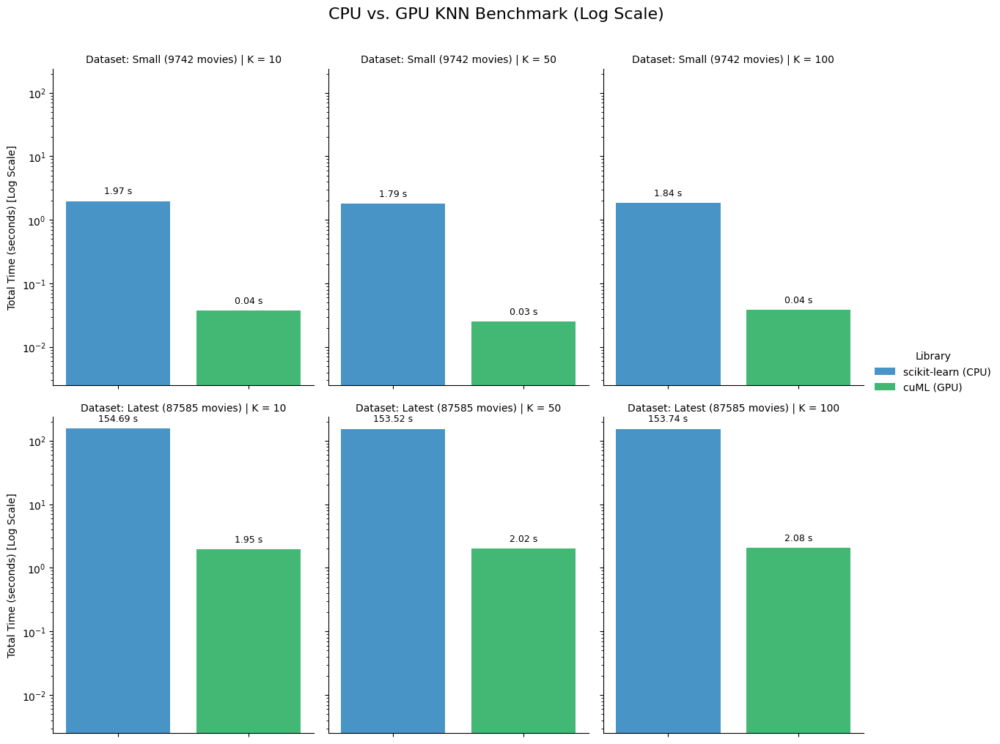

# Performance and Scalability Analysis of KNN Implementations for Content-Based Filtering

This repository contains a comprehensive benchmark analysis comparing the performance of CPU-based `scikit-learn` against GPU-accelerated `RAPIDS cuML` for a K-Nearest Neighbors (KNN) task.

The analysis is broken into two parts, each in its own notebook:

1.  **Analysis 1: Scaling by Data Size (N):** Compares performance on a small dataset (~9.7k items) vs. a large dataset (~87k items) while holding `K` constant.
2.  **Analysis 2: Scaling by Workload (K):** Compares performance on both datasets while varying the number of neighbors (`K=10, 50, 100`).

---

##  notebooks

**Notebook 1: Data Size (N) Scaling Benchmark**

)
**Notebook 2: Data Size (N) and Workload (K) Scaling Benchmark**

---

## Analysis 1: Scaling by Data Size (N)

This benchmark answers: **"How much faster is the GPU as the dataset gets bigger?"**

### Key Finding

The GPU's advantage increases dramatically with data size. On the large dataset, the GPU was **~81x faster**, completing a 7.6 billion comparison task in **1.92 seconds** versus the CPU's 155 seconds (2.6 minutes).

### Benchmark Results (at K=10)

| Dataset | Library | Time (s) | Speedup |
| :--- | :--- | ---:| ---:|
| Small (9,742 movies) | scikit-learn (CPU) | 1.8290 | - |
| Small (9,742 movies) | cuML (GPU) | 0.0371 | **49.3x** |
| Latest (87,585 movies) | scikit-learn (CPU) | 155.5607 | - |
| Latest (87,585 movies) | cuML (GPU) | 1.9223 | **80.9x** |

   
  <em>Note: This chart (from the first notebook) shows results from an earlier run. The table reflects the most recent data.</em>

---

## Analysis 2: Scaling by Workload (K)

This benchmark answers: **"How does performance change as we ask for more neighbors (K)?"**

### Key Finding

Changing `K` from 10 to 100 has a **negligible impact on performance** for both the CPU and GPU. This proves that for a `brute-force` $O(N^2)$ algorithm, the overwhelming bottleneck is the **distance calculation** (comparing all 7.6 billion pairs), not the **neighbor selection** (sorting to find the top K).

### Speedup Analysis Table

| | K | cuML (GPU) | scikit-learn (CPU) | Speedup (x) |
| :--- | :--- | ---:| ---:| ---:|
| **Latest (87,585 movies)** | **10** | 1.92 | 155.56 | **80.92** |
| | **50** | 1.98 | 154.66 | **78.07** |
| | **100** | 2.04 | 154.93 | **76.13** |
| **Small (9,742 movies)** | **10** | 0.04 | 1.83 | **49.35** |
| | **50** | 0.04 | 1.83 | **48.45** |
| | **100** | 0.04 | 1.89 | **49.13** |

 

  

---

## Methodology: The Experiment

Both analyses use the same core methodology to compare the time to find the K-Nearest Neighbors for every single item in the dataset.

| Parameter | Detail |
| :--- | :--- |
| **Task** | Benchmark K-Nearest Neighbors (KNN) |
| **Datasets** | <ul><li>**MovieLens Small** (~9.7k items)</li><li>**MovieLens Latest** (~87k items)</li></ul> |
| **Similarity Metric** | Jaccard Similarity |
| **Algorithm** | `brute-force` (exhaustive $O(N^2)$ comparison) |
| **CPU Library** | `scikit-learn` |
| **GPU Library** | `RAPIDS cuML` |
| **GPU Hardware** | NVIDIA T4 (via Google Colab) |

---

## The Math: $O(N^2)$ Comparison

Both libraries use a **"brute-force"** algorithm, which means for a dataset with $N$ movies, they must compute the similarity for every single pair of movies. This is an $O(N^2)$ operation.

### Total Comparisons
1.  **MovieLens Small ($N \approx 9,700$):**
    Total Comparisons $\approx \frac{N^2}{2} \approx \frac{9,700^2}{2} \approx$ **47 Million Comparisons!**

2.  **MovieLens Latest ($N \approx 87,000$):**
    Total Comparisons $\approx \frac{N^2}{2} \approx \frac{87,000^2}{2} \approx$ **7.6 Billion Comparisons!**

### The Metric: Jaccard Similarity
The similarity metric used is **Jaccard Similarity**, which calculates the ratio of shared genres to the total unique genres between two movies:

$$ J(A, B) = \frac{|A \cap B|}{|A \cup B|} $$

Where $A$ and $B$ are the sets of genres for two movies.

---

## How to Run This Benchmark

The notebooks are designed to run in Google Colab.

1.  Click the **"Open In Colab"** badges at the top of this README to open your desired notebook.
2.  In the Colab notebook, go to **Runtime > Change runtime type** and select **`T4 GPU`** (or any other available GPU).
3.  Run all cells in order from top to bottom.

---

## Acknowledgements
* This project was prepared for the **CMP5104: Recommender Systems** master's class under the guidance of **Doç. Dr. Tevfik Aytekin**.
* This benchmark uses datasets provided by the [GroupLens research lab](https://grouplens.org/datasets/movielens/) at the University of Minnesota.
* This project is powered by the [NVIDIA RAPIDS](https://rapids.ai/) open-source software libraries.
