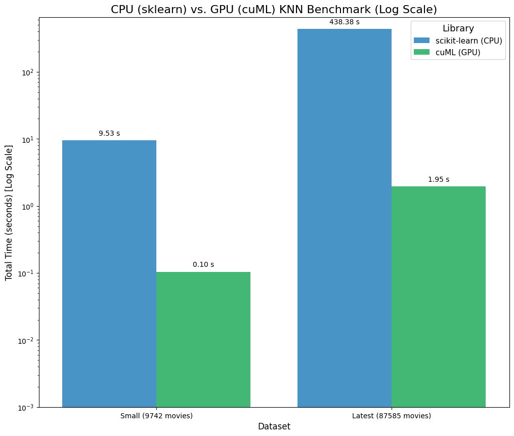

# CPU vs. GPU: A K-Nearest Neighbors Benchmark

This repository contains a comprehensive benchmark analysis comparing the performance of CPU-based `scikit-learn` against GPU-accelerated `RAPIDS cuML` for a K-Nearest Neighbors (KNN) task.

The goal is to quantify the performance and scalability of GPU computing on a common, computationally-intensive machine learning algorithm.

### Key Finding

The GPU-accelerated `cuML` was **228x faster** than `scikit-learn` on the largest dataset, completing a 7.6 billion comparison task in **1.94 seconds** versus the CPU's 442 seconds (7.4 minutes).

---

## Benchmark Results

Here is the final performance comparison. The chart uses a **logarithmic scale** to visualize the massive difference in performance.

  

| Dataset | Library | Time (s) |
| :--- | :--- | ---:|
| Small (9,742 movies) | scikit-learn (CPU) | 5.1329 |
| Small (9,742 movies) | cuML (GPU) | 0.1531 |
| **Latest (87,585 movies)** | **scikit-learn (CPU)** | **442.0171** |
| **Latest (87,585 movies)** | **cuML (GPU)** | **1.9405** |

* **Speedup on Small Dataset: 33.5x faster**
* **Speedup on Latest Dataset: 227.8x faster**

---

## The Experiment

This benchmark compares the time to find the K-Nearest Neighbors for every single item in the dataset.

| Parameter | Detail |
| :--- | :--- |
| **Task** | Benchmark K-Nearest Neighbors (KNN) |
| **Datasets** | <ul><li>**MovieLens Small** (~9.7k items)</li><li>**MovieLens Latest** (~87k items)</li></ul> |
| **Similarity Metric** | Jaccard Similarity |
| **Algorithm** | `brute-force` (exhaustive $O(N^2)$ comparison) |
| **CPU Library** | `scikit-learn` |
| **GPU Library** | `RAPIDS cuML` |
| **GPU Hardware** | NVIDIA T4 (via Google Colab) |

---

## The Math: $O(N^2)$ Comparison

Both libraries use a **"brute-force"** algorithm, which means for a dataset with $N$ movies, they must compute the similarity for every single pair of movies. This is an $O(N^2)$ operation.

### Total Comparisons
1.  **MovieLens Small ($N \approx 9,700$):**
    Total Comparisons $\approx \frac{N^2}{2} \approx \frac{9,700^2}{2} \approx$ **47 Million Comparisons!**

2.  **MovieLens Latest ($N \approx 87,000$):**
    Total Comparisons $\approx \frac{N^2}{2} \approx \frac{87,000^2}{2} \approx$ **7.6 Billion Comparisons!**

### The Metric: Jaccard Similarity
The similarity metric used is **Jaccard Similarity**, which calculates the ratio of shared genres to the total unique genres between two movies:

$$ J(A, B) = \frac{|A \cap B|}{|A \cup B|} $$

Where $A$ and $B$ are the sets of genres for two movies.

---

## How to Run This Benchmark

This notebook is designed to run in Google Colab.

1.  Click the **"Open In Colab"** badge at the top of this README.
2.  In the Colab notebook, go to **Runtime > Change runtime type** and select **`T4 GPU`** (or any other available GPU).
3.  Run all cells in order from top to bottom.

---

## Conclusion

As the benchmark clearly shows, the GPU-accelerated `cuML` library is dramatically faster on both datasets.

* On the "Small" dataset (9,742 movies), the GPU was **33.5x** faster.
* On the "Latest" dataset (87,585 movies), the GPU was **227.8x** faster.

This demonstrates two key points:
1.  **Massive Parallelism:** The GPU performed 7.6 billion comparisons in **1.94 seconds**, while the multi-core CPU took **442 seconds** (over 7 minutes) to do the same task.
2.  **Scalability:** The speedup *increased dramatically* with the dataset size (from 33x to 228x). This shows that as the problem gets harder, the GPU's advantage becomes even more significant. For modern, large-scale data, GPU acceleration is a game-changing technology.

### Acknowledgements
* This project was prepared for the **CMP5104: Recommender Systems** master's class under the guidance of **Doç. Dr. Tevfik Aytekin**.
* This benchmark uses datasets provided by the [GroupLens research lab](https://grouplens.org/datasets/movielens/) at the University of Minnesota.
* This project is powered by the [NVIDIA RAPIDS](https://rapids.ai/) open-source software libraries.
